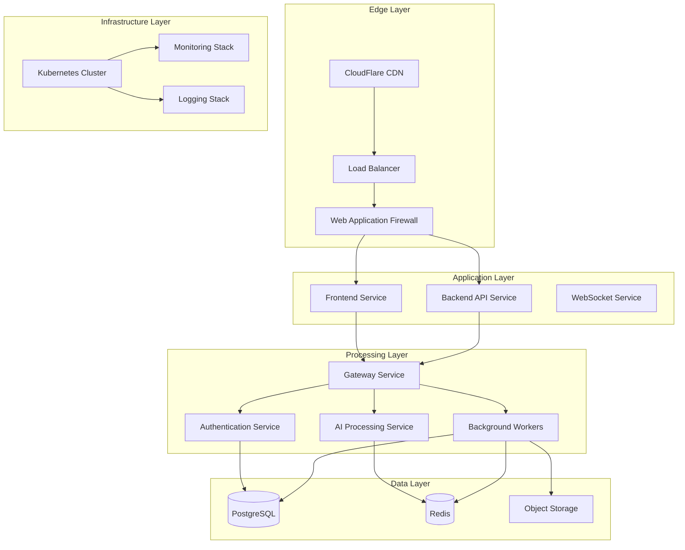

# MotionMath AI: Enterprise Gesture-Driven Mathematical Solver

[](https://github.com/motionmath/motionmath-ai/actions/workflows/ci.yml)
[](https://github.com/motionmath/motionmath-ai/actions/workflows/docker-publish.yml)
[](https://opensource.org/licenses/MIT)
[](http://makeapullrequest.com)
[](https://hub.docker.com/r/motionmath/backend)
[](https://hub.docker.com/r/motionmath/frontend)
[](https://codecov.io/gh/motionmath/motionmath-ai)
[](https://sonarcloud.io/dashboard?id=motionmath-motionmath-ai)
[](https://sonarcloud.io/dashboard?id=motionmath-motionmath-ai)

**MotionMath AI** is an enterprise-grade AI-powered mathematical equation solver that allows users to solve complex equations using intuitive hand gestures. Built for high performance and scalability, it leverages MediaPipe for hand tracking and OpenAI for intelligence, designed to handle **1 million+ monthly active users**.

## 🚀 Features

- **🎯 Gesture Control**: Draw, Solve, Erase, and Undo using hand gestures
- **🤖 AI-Powered**: Advanced equation solving via LLMs with 95%+ accuracy
- **🏗️ Enterprise Ready**: Multi-stage Docker builds, K8s manifests, and CI/CD
- **📈 Scalable**: Built-in support for Redis caching and horizontal scaling
- **🔒 Secure**: Rate limiting, structured logging, and CodeQL scanning
- **📊 Monitoring**: Prometheus + Grafana with comprehensive alerting
- **🌍 Global**: Multi-region deployment with CDN optimization
- **🔧 Developer-Friendly**: RESTful API, SDKs, and comprehensive documentation

## 🏗️ Architecture

Refer to the [Architecture Documentation](docs/architecture.md) for a detailed breakdown.



## 🛠️ Tech Stack

### Frontend
- **Framework**: Next.js 14 with TypeScript
- **Styling**: Tailwind CSS + Shadcn/ui
- **State Management**: Zustand
- **Computer Vision**: MediaPipe + TensorFlow.js
- **Testing**: Jest + Cypress

### Backend
- **Framework**: FastAPI (Python 3.11)
- **Database**: PostgreSQL 15 with SQLAlchemy
- **Cache**: Redis 7 Cluster
- **Queue**: Celery for background jobs
- **AI**: OpenAI API + Custom ML models
- **Testing**: Pytest + Locust

### Infrastructure
- **Containerization**: Docker with multi-stage builds
- **Orchestration**: Kubernetes with HPA/CA
- **CI/CD**: GitHub Actions with enterprise workflows
- **Monitoring**: Prometheus + Grafana + ELK Stack
- **Security**: Trivy + CodeQL + Dependabot

### Cloud Services
- **Compute**: AWS EKS / Google GKE / Azure AKS
- **Storage**: AWS S3 / Google GCS / Azure Blob
- **Database**: AWS RDS / Google Cloud SQL
- **CDN**: CloudFlare + Vercel Edge Network
- **Load Balancing**: AWS ALB / Google Cloud Load Balancer

## 🚦 Getting Started

### Prerequisites

- **Node.js**: 18+ 
- **Python**: 3.11+
- **Docker**: 20.10+
- **Kubernetes**: 1.25+ (for production)
- **kubectl**: 1.25+ (for production)

### Local Development

1. **Clone the repository**:

   ```bash
   git clone https://github.com/your-org/motionmath-ai.git
   cd motionmath-ai
   ```

2. **Environment setup**:

   ```bash
   # Copy environment templates
   cp .env.example .env
   cp frontend/.env.example frontend/.env.local
   cp backend/.env.example backend/.env
   
   # Edit configuration files
   nano .env
   ```

3. **Start with Docker Compose**:

   ```bash
   # Start all services
   docker compose up -d --build
   
   # View logs
   docker compose logs -f
   ```

4. **Access the application**:

   - **Frontend**: [http://localhost:3000](http://localhost:3000)
   - **Backend API**: [http://localhost:8000](http://localhost:8000)
   - **API Docs**: [http://localhost:8000/docs](http://localhost:8000/docs)
   - **Grafana**: [http://localhost:3001](http://localhost:3001)
   - **Prometheus**: [http://localhost:9090](http://localhost:9090)

### Manual Development Setup

1. **Backend Setup**:

   ```bash
   cd backend
   python -m venv venv
   source venv/bin/activate  # On Windows: venv\Scripts\activate
   pip install -r requirements.txt
   uvicorn main:app --reload --host 0.0.0.0 --port 8000
   ```

2. **Frontend Setup**:

   ```bash
   cd frontend
   npm install
   npm run dev
   ```

3. **Database Setup**:

   ```bash
   # Start PostgreSQL and Redis
   docker compose up -d db redis
   
   # Run migrations
   cd backend
   alembic upgrade head
   ```

## 🌐 Production Deployment

### Quick Deploy (Recommended)

```bash
# Deploy to Kubernetes
chmod +x scripts/deploy.sh
./scripts/deploy.sh

# Monitor deployment
kubectl get pods -n motionmath-prod -w
```

### Manual Deployment

1. **Infrastructure Setup**:

   ```bash
   # Create namespace and policies
   kubectl apply -f infrastructure/kubernetes/namespace-enhanced.yaml
   
   # Deploy secrets and configmaps
   kubectl apply -f infrastructure/kubernetes/secrets-enhanced.yaml
   kubectl apply -f infrastructure/kubernetes/configmap-enhanced.yaml
   ```

2. **Database Deployment**:

   ```bash
   # Deploy PostgreSQL cluster
   kubectl apply -f infrastructure/kubernetes/database-enhanced.yaml
   
   # Wait for readiness
   kubectl wait --for=condition=ready pod -l app=postgres -n motionmath-prod --timeout=300s
   ```

3. **Application Deployment**:

   ```bash
   # Deploy services
   kubectl apply -f infrastructure/kubernetes/backend.yaml
   kubectl apply -f infrastructure/kubernetes/frontend.yaml
   kubectl apply -f infrastructure/kubernetes/celery.yaml
   
   # Deploy ingress and HPA
   kubectl apply -f infrastructure/kubernetes/ingress-enhanced.yaml
   kubectl apply -f infrastructure/kubernetes/hpa-enhanced.yaml
   ```

4. **Monitoring Setup**:

   ```bash
   # Install monitoring stack
   chmod +x scripts/monitoring-setup.sh
   ./scripts/monitoring-setup.sh
   ```

For detailed deployment instructions, see the [Deployment Guide](docs/deployment.md).

## 📚 Documentation

- **[Architecture Documentation](docs/architecture.md)**: System design and technical architecture
- **[API Documentation](docs/api.md)**: REST API reference and examples
- **[Deployment Guide](docs/deployment.md)**: Production deployment instructions
- **[Contributing Guide](CONTRIBUTING.md)**: How to contribute to the project
- **[Security Policy](SECURITY.md)**: Security reporting and policies
- **[Code of Conduct](CODE_OF_CONDUCT.md)**: Community guidelines

## 🔧 Development

### Code Quality

- **Linting**: ESLint + Flake8 with pre-commit hooks
- **Formatting**: Prettier + Black with automatic formatting
- **Type Checking**: TypeScript + MyPy for static analysis
- **Testing**: 80%+ code coverage requirement

### Testing

```bash
# Frontend tests
cd frontend
npm test
npm run test:e2e

# Backend tests
cd backend
pytest --cov=. --cov-report=html

# Integration tests
docker compose -f docker-compose.test.yml up --abort-on-container-exit
```

### Performance Testing

```bash
# Install k6
# https://k6.io/docs/getting-started/installation/

# Run load tests
k6 run tests/performance/load-test.js
```

### Security Scanning

```bash
# Run security scans
./scripts/security-hardening.sh

# Container scanning
trivy image motionmath-backend:latest
trivy image motionmath-frontend:latest
```

## 📊 Monitoring and Observability

### Key Metrics

- **Response Time**: < 200ms (95th percentile)
- **Throughput**: 10,000 requests/second
- **Availability**: 99.9% uptime SLA
- **Error Rate**: < 0.1%

### Dashboards

- **Grafana**: [https://grafana.motionmath.ai](https://grafana.motionmath.ai)
- **Prometheus**: [https://prometheus.motionmath.ai](https://prometheus.motionmath.ai)
- **Kibana**: [https://logs.motionmath.ai](https://logs.motionmath.ai)

### Alerting

- **Critical**: Service downtime, security incidents
- **Warning**: Performance degradation, high resource usage
- **Info**: Deployments, configuration changes

## 🔐 Security

- **Authentication**: OAuth 2.0 + JWT with MFA support
- **Authorization**: RBAC with fine-grained permissions
- **Encryption**: AES-256 at rest, TLS 1.3 in transit
- **Vulnerability Management**: Automated scanning + patching
- **Compliance**: SOC 2, GDPR, HIPAA ready

For security concerns, see our [Security Policy](SECURITY.md).

## 📈 Scalability

### Horizontal Scaling

- **Pod Autoscaling**: HPA based on CPU, memory, custom metrics
- **Cluster Autoscaling**: Automatic node provisioning
- **Database Scaling**: Read replicas + sharding support
- **Cache Scaling**: Redis Cluster with automatic rebalancing

### Capacity Planning

- **Current Capacity**: 1M MAU
- **Target Capacity**: 10M MAU
- **Scaling Strategy**: 2x capacity every 6 months
- **Resource Allocation**: 70% utilization target

## 🤝 Contributing

We love contributions! Please read our [Contributing Guide](CONTRIBUTING.md) and [Code of Conduct](CODE_OF_CONDUCT.md).

### Quick Start

1. Fork the repository
2. Create a feature branch: `git checkout -b feature/amazing-feature`
3. Commit changes: `git commit -m 'Add amazing feature'`
4. Push to branch: `git push origin feature/amazing-feature`
5. Open a Pull Request

### Development Guidelines

- Follow the existing code style
- Add tests for new features
- Update documentation
- Ensure all CI checks pass

## 💖 Sponsorship

Support the project development via [GitHub Sponsors](.github/FUNDING.yml).

## 🏆 Sponsors

- **Platinum**: [Your Company Here]
- **Gold**: [Your Company Here]
- **Silver**: [Your Company Here]

## 📜 License

This project is licensed under the MIT License - see the [LICENSE](LICENSE) file for details.

## 🙏 Acknowledgments

- [MediaPipe](https://mediapipe.dev/) for hand tracking
- [OpenAI](https://openai.com/) for AI capabilities
- [Next.js](https://nextjs.org/) for the frontend framework
- [FastAPI](https://fastapi.tiangolo.com/) for the backend framework
- [Kubernetes](https://kubernetes.io/) for container orchestration

## 📞 Support

- **Documentation**: [docs.motionmath.ai](https://docs.motionmath.ai)
- **API Reference**: [api.motionmath.ai](https://api.motionmath.ai/docs)
- **Community**: [Discord](https://discord.gg/motionmath)
- **Email**: [support@motionmath.ai](mailto:support@motionmath.ai)
- **Status**: [status.motionmath.ai](https://status.motionmath.ai)

---

**Built with ❤️ by the MotionMath AI team**

[](https://github.com/motionmath/motionmath-ai)
[](https://www.typescriptlang.org/)
[](https://fastapi.tiangolo.com/)
