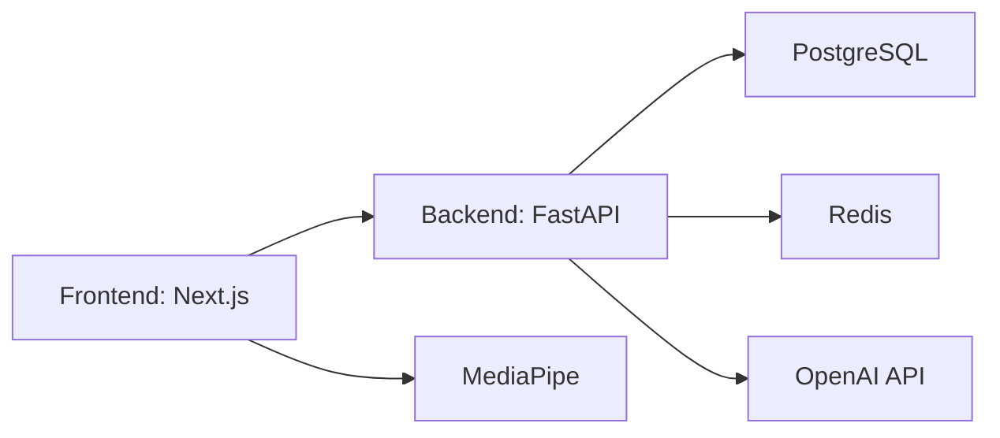

# MotionMath AI: Gesture-Driven Mathematical Solver

[](https://github.com/motionmath/motionmath-ai/actions/workflows/ci.yml)
[](https://github.com/motionmath/motionmath-ai/actions/workflows/docker-publish.yml)
[](https://opensource.org/licenses/MIT)
[](http://makeapullrequest.com)

**MotionMath AI** is an enterprise-grade AI math board that allows users to solve complex equations using intuitive hand gestures. Built for high performance and scalability, it leverages MediaPipe for hand tracking and OpenAI for intelligence.

## 🚀 Features

- **Gesture Control**: Draw, Solve, Erase, and Undo using hand gestures.
- **AI-Powered**: Advanced equation solving via LLMs.
- **Enterprise Ready**: Multi-stage Docker builds, K8s manifests, and CI/CD.
- **Scalable**: Built-in support for Redis caching and horizontal scaling.
- **Secure**: Rate limiting, structured logging, and CodeQL scanning.

## 🏗️ Architecture

Refer to the [Architecture Documentation](docs/architecture.md) for a detailed breakdown.



## 🛠️ Tech Stack

- **Frontend**: Next.js 14, Tailwind CSS, TypeScript
- **Backend**: FastAPI (Python 3.11)
- **Infra**: Docker, Kubernetes, Nginx
- **Services**: Redis, PostgreSQL, OpenAI

## 🚦 Getting Started

### Prerequisites

- Node.js 18+
- Python 3.11+
- Docker & Docker Compose

### Local Development

1. **Clone the repository**:

   ```bash
   git clone https://github.com/your-org/motionmath-ai.git
   cd motionmath-ai
   ```

2. **Run with Docker Compose**:

   ```bash
   docker compose up --build
   ```

3. **Access the application**:
   - Frontend: [http://localhost:3000](http://localhost:3000)
   - Backend API: [http://localhost:8000](http://localhost:8000)
   - API Docs: [http://localhost:8000/docs](http://localhost:8000/docs)

## 🌐 Deployment

### Infrastructure as Code

Kubernetes manifests are located in `infrastructure/kubernetes/`.

### CI/CD

We use GitHub Actions for:

- **CI**: Linting, testing, and building.
- **CD**: Auto-deployment to Vercel and Render.
- **Security**: Weekly CodeQL scans and Dependabot updates.

## 🔐 Security & Best Practices

- Standardized coding styles via `.editorconfig`.
- Pre-commit hooks via Husky.
- Rate limiting at the application level.
- Structured JSON logging.

## 🤝 Contributing

We love contributions! Please read our [Contributing Guide](CONTRIBUTING.md) and [Code of Conduct](CODE_OF_CONDUCT.md).

## 💖 Sponsorship

Support the project development via [Sponsors](.github/FUNDING.yml).

## 📜 License

This project is licensed under the MIT License - see the [LICENSE](LICENSE) file for details.

- Update: feat: implement basic math operations

- Update: style: format code according to project standards

- Update: chore: update dependencies to latest versions

- Update: docs: add installation guide

- Update: test: increase test coverage to 85%

- Update: fix: resolve memory leak in calculations

- Update: refactor: optimize database queries

- Update: feat: add support for mathematical expressions

- Update: style: remove unused imports and variables
