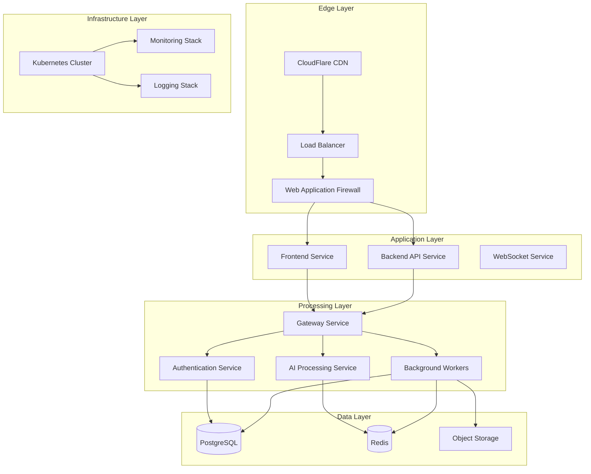
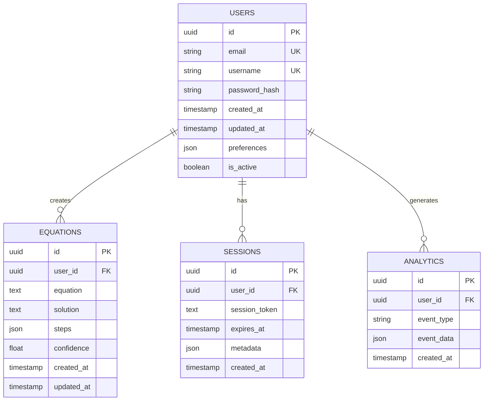

# MotionMath AI: Enterprise Architecture Documentation

## Overview

MotionMath AI is an enterprise-grade, AI-powered mathematical equation solver that uses hand gestures for intuitive interaction. Built for scalability and performance, it's designed to handle **1 million+ monthly active users** with high availability and security.

## Architecture Principles

- **Microservices Architecture**: Loosely coupled, independently deployable services
- **Cloud-Native**: Containerized with Kubernetes orchestration
- **Event-Driven**: Asynchronous processing with message queues
- **Security-First**: Defense-in-depth security model
- **Observability**: Comprehensive monitoring and logging
- **Scalability**: Horizontal scaling with auto-scaling policies

## System Architecture



## Component Architecture

### Frontend Service
- **Technology**: Next.js 14, TypeScript, Tailwind CSS
- **Features**: Server-side rendering, static generation, API routes
- **Deployment**: Kubernetes Deployment with HPA
- **Scaling**: 4-30 pods based on CPU/memory metrics

### Backend API Service
- **Technology**: FastAPI, Python 3.11, SQLAlchemy
- **Features**: RESTful API, WebSocket support, async processing
- **Deployment**: Kubernetes Deployment with HPA
- **Scaling**: 6-50 pods based on request rate

### AI Processing Service
- **Technology**: OpenAI API, MediaPipe, TensorFlow.js
- **Features**: Hand gesture recognition, equation solving, ML models
- **Deployment**: Kubernetes Deployment with GPU support
- **Scaling**: 2-20 pods based on processing queue

### Background Workers
- **Technology**: Celery, Redis, Python
- **Features**: Asynchronous task processing, scheduled jobs
- **Deployment**: Kubernetes StatefulSet
- **Scaling**: 4 workers with queue-based scaling

## Data Architecture

### Database Schema


### Caching Strategy
- **Redis Cluster**: Distributed caching with replication
- **Cache Levels**: L1 (in-memory), L2 (Redis), L3 (CDN)
- **Cache Invalidation**: TTL-based + event-driven
- **Cache Patterns**: Cache-aside, write-through, write-behind

## Security Architecture

### Defense in Depth
1. **Network Security**: VPC, firewalls, network policies
2. **Application Security**: WAF, rate limiting, input validation
3. **Data Security**: Encryption at rest and in transit
4. **Identity Security**: OAuth 2.0, JWT, MFA
5. **Operational Security**: Audit logs, monitoring, incident response

### Security Controls
- **Authentication**: OAuth 2.0 with Google, GitHub, email
- **Authorization**: RBAC with fine-grained permissions
- **Encryption**: AES-256 for data, TLS 1.3 for transport
- **Secrets Management**: Kubernetes Secrets + external vault
- **Vulnerability Management**: Automated scanning + patching

## Performance Architecture

### Performance Targets
- **Response Time**: < 200ms (95th percentile)
- **Throughput**: 10,000 requests/second
- **Availability**: 99.9% uptime
- **Error Rate**: < 0.1%

### Optimization Strategies
- **Database**: Connection pooling, query optimization, indexing
- **Caching**: Multi-layer caching with intelligent invalidation
- **CDN**: Static assets caching at edge locations
- **Load Balancing**: Layer 7 load balancing with health checks

## Scalability Architecture

### Horizontal Scaling
- **Pod Autoscaling**: HPA based on CPU, memory, custom metrics
- **Cluster Autoscaling**: CA based on resource utilization
- **Database Scaling**: Read replicas + sharding
- **Cache Scaling**: Redis Cluster with automatic rebalancing

### Capacity Planning
- **Current Capacity**: 1M MAU
- **Target Capacity**: 10M MAU
- **Scaling Strategy**: 2x capacity every 6 months
- **Resource Allocation**: 70% utilization target

## Technology Stack

### Frontend
- **Framework**: Next.js 14
- **Language**: TypeScript
- **Styling**: Tailwind CSS
- **State Management**: Zustand
- **UI Components**: Shadcn/ui
- **Testing**: Jest + Cypress

### Backend
- **Framework**: FastAPI
- **Language**: Python 3.11
- **Database**: PostgreSQL 15
- **Cache**: Redis 7
- **Queue**: Celery
- **Testing**: Pytest + Locust

### Infrastructure
- **Container**: Docker
- **Orchestration**: Kubernetes
- **CI/CD**: GitHub Actions
- **Monitoring**: Prometheus + Grafana
- **Logging**: ELK Stack
- **Security**: Trivy + CodeQL

### Cloud Services
- **Provider**: AWS/GCP/Azure
- **Compute**: EKS/GKE/AKS
- **Storage**: S3/GCS/Blob
- **Database**: RDS/Cloud SQL
- **Network**: VPC + Load Balancers

## Development Workflow

### Local Development
```bash
# Start all services
docker-compose up -d

# Run frontend
cd frontend && npm run dev

# Run backend
cd backend && uvicorn main:app --reload

# Run tests
npm test && pytest
```

### Code Quality
- **Linting**: ESLint + Flake8
- **Formatting**: Prettier + Black
- **Type Checking**: TypeScript + MyPy
- **Pre-commit**: Husky + pre-commit hooks

### Testing Strategy
- **Unit Tests**: 80% code coverage
- **Integration Tests**: API endpoints
- **E2E Tests**: User workflows
- **Performance Tests**: Load testing with k6

## Operational Procedures

### Incident Response
1. **Detection**: Automated monitoring alerts
2. **Assessment**: Impact analysis and severity rating
3. **Response**: Containment and resolution
4. **Recovery**: Service restoration
5. **Post-mortem**: Root cause analysis

### Change Management
1. **Planning**: Change request and risk assessment
2. **Approval**: Stakeholder review and approval
3. **Implementation**: Scheduled change window
4. **Verification**: Testing and validation
5. **Documentation**: Update documentation

### Capacity Management
1. **Monitoring**: Resource utilization tracking
2. **Planning**: Capacity forecasting
3. **Scaling**: Proactive scaling actions
4. **Optimization**: Performance tuning
5. **Reporting**: Regular capacity reports

## Compliance and Governance

### Compliance Standards
- **SOC 2**: Security and availability controls
- **GDPR**: Data protection and privacy
- **HIPAA**: Healthcare data protection (if applicable)
- **ISO 27001**: Information security management

### Governance Framework
- **Access Control**: Principle of least privilege
- **Data Classification**: Public, internal, confidential
- **Audit Trail**: Comprehensive logging and monitoring
- **Risk Management**: Regular risk assessments

## Future Roadmap

### Short Term (3-6 months)
- **Enhanced AI Models**: Improved accuracy and new features
- **Mobile App**: React Native mobile application
- **Advanced Analytics**: User behavior insights
- **Performance Optimization**: Database and caching improvements

### Medium Term (6-12 months)
- **Multi-tenant Architecture**: SaaS capabilities
- **Advanced Security**: Zero-trust security model
- **Global Expansion**: Multi-region deployment
- **API Ecosystem**: Third-party integrations

### Long Term (12+ months)
- **Edge Computing**: Local processing capabilities
- **AI Model Training**: Custom model training pipeline
- **Advanced Features**: Real-time collaboration
- **Enterprise Features**: SSO, audit logs, compliance

## Conclusion

MotionMath AI's architecture is designed for enterprise-scale deployment with high availability, security, and performance. The modular design allows for independent scaling and evolution of components while maintaining system coherence and operational excellence.

The architecture supports the target of 1M+ MAU through horizontal scaling, efficient resource utilization, and comprehensive monitoring and automation. The security-first approach ensures data protection and compliance with industry standards.
