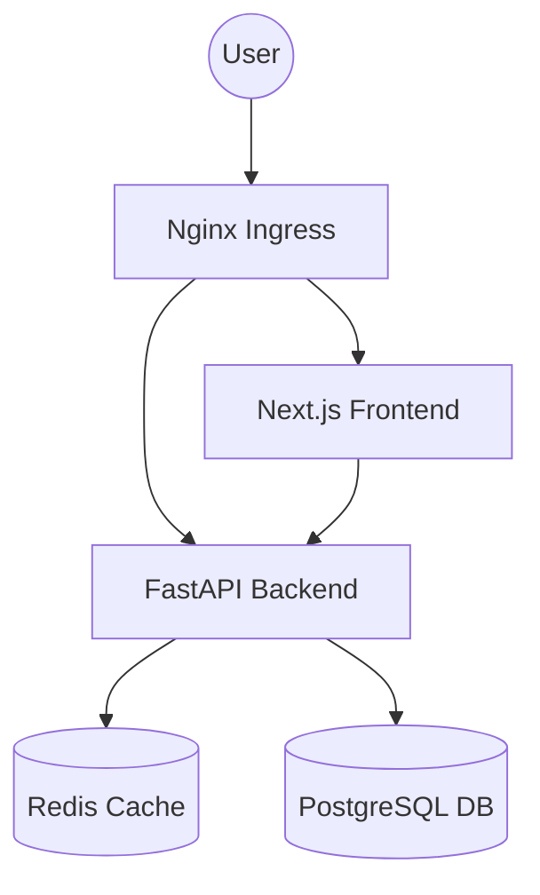

# System Architecture

MotionMath AI is built with a modern, scalable, and secure architecture designed to handle 1M+ monthly active users.

## High-Level Overview

## Tech Stack

- **Frontend**: Next.js (TypeScript, Tailwind CSS, MediaPipe for Gesture Tracking)
- **Backend**: FastAPI (Python, Uvicorn)
- **Database**: PostgreSQL (Prisma/SQLAlchemy)
- **Caching**: Redis
- **Infra**: Docker, Kubernetes, GitHub Actions (CI/CD)
- **Hosting**: Vercel (Frontend), Render/Railway (Backend)

## Scalability Design

- **Stateless Backend**: Backend instances are stateless, allowing for easy horizontal scaling via Kubernetes HPA.
- **Caching Layer**: Redis is used for rate limiting and potentially session management/transient data to reduce DB load.
- **Connection Pooling**: Production configuration uses connection pooling for PostgreSQL.
- **CDN**: Frontend is served via Vercel's Edge Network for global low latency.

## Security

- **JWT Authentication**: Secure token-based access.
- **Rate Limiting**: Protection against DDoS and brute force at the application level.
- **Secrets Management**: K8s Secrets and GitHub Env Secrets.
- **Code Scanning**: CodeQL static analysis in CI.
